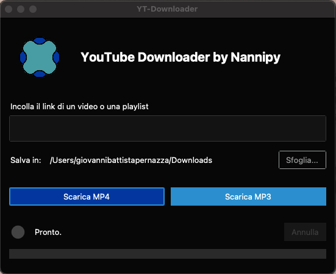

<p align="center">
  
</p>


# YT-Downloader

YT-Downloader è un'applicazione desktop moderna per scaricare video e audio da YouTube, con interfaccia grafica elegante basata su [ttkbootstrap](https://ttkbootstrap.readthedocs.io/) e [yt-dlp](https://github.com/yt-dlp/yt-dlp).

## Funzionalità

- Scarica video in formato **MP4** o solo audio in **MP3**
- Interfaccia utente intuitiva e moderna
- Selezione della cartella di destinazione
- Barra di avanzamento e stato del download
- Supporto per playlist e singoli video
- Conversione automatica in MP3 tramite ffmpeg
- Compatibile con Windows, macOS e Linux

## Requisiti

- Python 3.12+
- [yt-dlp](https://github.com/yt-dlp/yt-dlp)
- [ttkbootstrap](https://ttkbootstrap.readthedocs.io/)
- ffmpeg e ffprobe (inclusi nel bundle o rilevati automaticamente)

## Installazione

1. **Clona il repository:**
   ```sh
   git clone <URL-del-tuo-repo>
   cd ytdl-py
   ```

2. **Installa le dipendenze:**
   ```sh
   pip install yt-dlp ttkbootstrap
   ```

3. **Assicurati che ffmpeg sia disponibile:**
   - Su macOS: installa con Homebrew (`brew install ffmpeg`)
   - Su Windows: scarica da [ffmpeg.org](https://ffmpeg.org/download.html) e aggiungi alla variabile PATH
   - Oppure copia `ffmpeg` e `ffprobe` nella cartella principale del progetto

## Utilizzo

Avvia l'applicazione con:

```sh
python downloader_nannipy.py
```

### Modalità Standalone

Il progetto può essere "bundlato" in un eseguibile standalone tramite PyInstaller. Usa il file `YT-Downloader-Pro.spec` per la configurazione.

```sh
pyinstaller YT-Downloader-Pro.spec
```

### Screenshot


<p align="center">
  
</p>


## Struttura del progetto

- `downloader_nannipy.py` — Codice principale dell'applicazione GUI
- `ffmpeg`, `ffprobe` — Binari ffmpeg inclusi per il bundle
- `icon.png`, `logo.png` — Icone e logo dell'app
- `build/` — Output di PyInstaller (cartella generata)
- `YT-Downloader-Pro.spec` — Configurazione PyInstaller

## Licenza

Questo progetto è distribuito sotto licenza MIT.

---

**Autore:** nannipy  
**Data di creazione:** 2025


Powered by yt-dlp & ttkbootstrap
